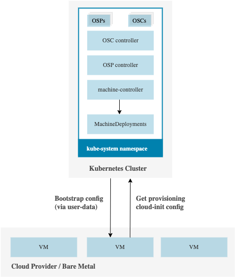
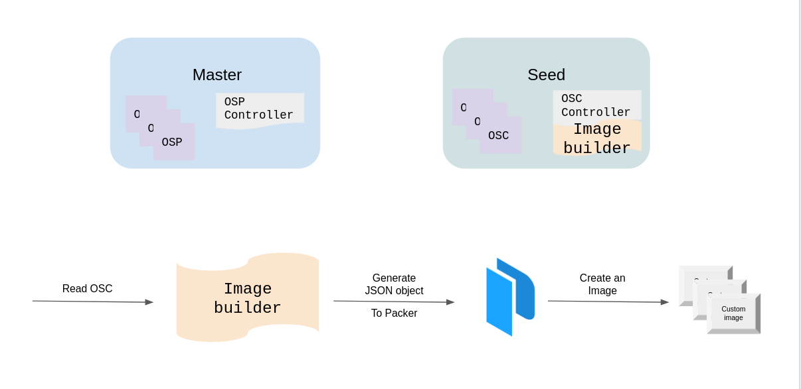

# [Experimental] Kubermatic operating-system-manager

Operating System Manager is responsible for creating and managing the required configurations for worker nodes in a kubernetes cluster.

## Project Status

This project is experimental and currently a work-in-progress. **This is not supposed to be used in production environments**.

## Overview

### Problem Statement

[Machine-Controller](https://github.com/kubermatic/machine-controller) can be used to create and manage worker nodes in a kubernetes clusters. For each supported operating system(based on the cloud provider), a specific plugin is used to generate cloud configs. These configs are then injected in the worker nodes using either [cloud-init](https://cloud-init.io/) or (ignition)[https://coreos.github.io/ignition/] based on the operating system. Finally the nodes are bootstrapped.

Currently this workflow has the following limitations/issues:

- Machine Controller expects **ALL** the supported OS plugins to exist and be ready. User might only be interested in a subset of the available operating systems.
- The `cloud-configs` are generated against pre-defined templates like [this](https://github.com/kubermatic/machine-controller/blob/master/pkg/userdata/ubuntu/provider.go#L133). This is not ideal because code changes are required to update those templates.
- Each cloud provider sets some limit for `user-data` size, machine won't be created in case of non-compliance. For example, at the time of writing this, AWS has set a [hard limit of 16KB](https://docs.aws.amazon.com/AWSEC2/latest/UserGuide/instancedata-add-user-data.html) for `user-data` size.
- Managing configs for multiple cloud providers, OS flavors and OS versions, adds a lot of complexity and redundancy in machine-controller.

### Solution

Operating System Manager was created to solve the above mentioned issues. It decouples operating system configurations into dedicated and isolable resources for better modularity and maintainability.

## Architecture

OSM introduces the following resources:

- OperatingSystemProfile: A resource that represents the details of each operating system.
- OperatingSystemConfig: A resource that contains the `cloud-configs` that are going to be used to bootstrap and provision the worker nodes.

`OperatingSystemConfig` are a subset of `OperatingSystemProfile` and are auto-generated by the `osc-controller` against a certain OSP and MachineDeployment.
For each cluster there are at least two OSC objects:

1. OSC for accessing the cluster; OSC is sent to the worker node via user-data and processed as a cloud-init or ignition config, in order to fetch the second OSC object.
2. OSC for provisioning the machine; OSC represents the actual cloud-config that provision the worker node.

The created OSCs are processed by the controllers and they eventually generate a secret inside each user cluster. Which is then consumed by the worker nodes.

### OperatingSystemProfile Controller

This controller runs in the `master` cluster and operates on the `OperatingSystemProfile` custom resource. It is responsible for creating the `OperatingSystemConfig` resources.

### OperatingSystemConfig Controller

This controller runs in the `seed` cluster in the namespace of the user cluster and operates on the `OperatingSystemConfig` custom resource. It is responsible for generating `user-data` secret through the OperatingSystemConfig resource.

### Air-gapped Environment

This controller was designed by keeping air-gapped environments in mind. Customers can use their own VM images by creating custom OSP profiles to provision nodes in a cluster that doesn't have outbound internet access.

More work is being done to make it even easier to use OSM in air-gapped environments.

## Support

Information about supported OS versions can be found [here](./docs/compatibility-matrix.md).

## Deploy OSM

[TBD]

_The code and sample YAML files in the master branch of the operating-system-manager repository are under active development and are not guaranteed to be stable. Use them at your own risk!_

## Development

### Testing

Simply run `make test`

### Local Development

To run OSM locally:

- Either use a [kind](https://kind.sigs.k8s.io/docs/user/quick-start/) cluster or actual cluster and make sure that the correct context is loaded
- Run `kubectl apply -f charts/crd` to install CRDs
- Create relevant OperatingSystemProfile resources. Check [sample](./examples) for reference.
- Run `make run`

## Troubleshooting

If you encounter issues [file an issue][1] or talk to us on the [#kubermatic channel][6] on the [Kubermatic Slack][7].

## Contributing

Thanks for taking the time to join our community and start contributing!

Feedback and discussion are available on [the mailing list][5].

### Before you start

- Please familiarize yourself with the [Code of Conduct][4] before contributing.
- See [CONTRIBUTING.md][2] for instructions on the developer certificate of origin that we require.
- Read how [we're using ZenHub][8] for project and roadmap planning

### Pull requests

- We welcome pull requests. Feel free to dig through the [issues][1] and jump in.

## Changelog

See [the list of releases][3] to find out about feature changes.

[1]: https://github.com/kubermatic/operating-system-manager/issues
[2]: https://github.com/kubermatic/operating-system-manager/blob/master/CONTRIBUTING.md
[3]: https://github.com/kubermatic/operating-system-manager/releases
[4]: https://github.com/kubermatic/operating-system-manager/blob/master/CODE_OF_CONDUCT.md
[5]: https://groups.google.com/forum/#!forum/kubermatic-dev
[6]: https://kubermatic.slack.com/messages/kubermatic
[7]: http://slack.kubermatic.io/
[8]: https://github.com/kubermatic/operating-system-manager/blob/master/Zenhub.md
